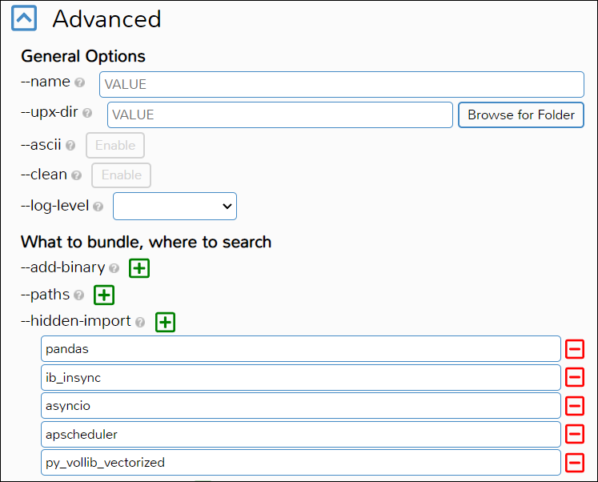

# Delta Neutral Trading Strategy: The Strangle

## Introduction
I have been interested in stock trading and finance since I came to college. This interest has led to my passion to study the idea of value in the markets. I would like to automate an existing strategy that I currently do manually that has generated consistent profit for me almost 80% of the time. Below is an explanation of the strategy and the results of my backtesting.

**NOTE: This project is for informational purposes only. This project and all information contained herein is not investment advice, and not intended to be investment advice. Any trades you make based on this information are your responsibility alone. The project maker disclaims any liability, loss, or risk resulting directly or indirectly, from the use or application of any of the contents of this project.**

### Design Overview and Consideration Process:
I had originally wanted to choose a broker/backtest package combo. By this, I mean a platform that allows you to backtest your strategy while also being able to actively trade it.
First, I started with QuantConnect, a popular platform that is used for testing different strategies using Python. After testing on this for a few days, I realized the platform is incredibly slow.
From there, I moved to Zorro, a platform that is used for testing strategies using C++. I was able to get a much faster backtest, but I was not able to find a broker that would allow me to trade the strategy I wanted without paying for the upgraded version of Zorro, Zorro S. I also found that the platform was not very user friendly, the (free) data I was provided was not clean, and the API was not well-documented.

After trying two broker/backtest combos, I decided it was time to try to make something on my own instead. I was funded a 1-month subscription to OptionOmega thanks to the ECE Department at Pitt, and backtested my strategy on there. My strategy seemed to outperform the market, which is all I need to start the development process.
For my broker, I decided to use Interactive Brokers (IB). I have used IB in the past, and I have found it to be a very reliable broker. I also found that IB has a very well-documented API, which will make the development process much easier.
I used a package called ib_insync to connect to the IB API made by Ewald de Wit. It made the IB API easier to use and quickened the development time substantially.

After I had a working model on my computer, I decided it was time to package the model into an executable so it could be run on an Azure VM.
To do this I used Auto-Py-To-Exe, a GUI version of PyInstaller. I was able to package the model into an executable in a matter of minutes, and since then I have been running it on the VM 24/7.
This project taught me that nothing really ever goes as easily as you expect it to, but so long as you have determination to reach a final product, you will make something that is just as good as what you had originally imagined.

### Design Verification:
To make sure my strategy was profitable, I put my rules set into OptionOmega and ran it over the past 3 years. It came back with profitable returns, proving the efficacy of my model. 
You can check out those returns below. Next, I started by making a basic program that connected to IB and returned account information.
I built off that and changed the design to sell a call and a put option simultaneously. Once I had my feet wet, I started looking for more inspiration into how I could
make something that was able to run 24/7 and survive IB's dreaded forced application restarts. This is where the implementation came in.

### Design Implementation:
I started by reorganizing the framework created in this [repo](https://github.com/Jake0303/RiskyOptionsBot) by Jake Amaral. This program waits for 3 consecutive 5-minute higher closes and sets the take profit at the next bar. While this strategy is
nowhere near similar to mine, the framework for order entry and management is spot on. I took this, and added my own twist to it by creating, what's named by IB, a BAG of options. This basically bundles the orders together into one contract so they all execute together.
Then the program will check to see if a trade or order is open, and if there isn't any open trades or orders it will decide the strikes to sell a call and put at, bundle them into a BAG, and ship them off to be executed.

The trade is sent as a bracket to the broker meaning the stop and take-profit are built into the strategy order. This makes it super convenient for me because the trade will automatically be managed by the broker. All the program needs to do is wait for there to be no open trade to make another order.
There is only one thing that I didn't consider until the end, but that is how to survive IB's forced application restarts. I had to add a try/except block to the main loop that would catch the disconnect event, wait 60 seconds, and then attempt to reconnect the program to IB. 
This took the longest to figure out since it isn't crystal clear from IB on how to do this, and IB_Insync doesn't have a built-in function to handle this.

Once I had this framework built and packaged as a class, I converted the Python file into an EXE using Auto-Py-To-Exe and loaded it onto the Azure VM where I have been running it ever since.

If you want more details about the intricacies of the program, you can check out the [design document.](https://github.com/ldt9/pyoptiontrador/blob/master/research/implementation/function_explanations.md)

### Design Testing/Validation:
I also tested the efficacy of the strike selection algorithms through the use of notebooks and multiple python files. When a strike was calculated and produced, I would confirm with the brokerage to prove the correct strike had been chosen by looking at the same option chain and its corresponding greeks. 
I also tested making standalone option orders and option orders to prove efficacy of the different ordering types such as market, limit and bracket orders. These files can be found in this [folder](https://github.com/ldt9/pyoptiontrador/tree/master/research/implementation).

Since April 12th, 2023 I have been running the program on an Azure VM 24/7. I have not had any issues with the program crashing or the VM shutting down. I have also not had any issues with the program not being able to connect to the broker.
I have stress tested the program by shutting down the IB Trader Workstation, the gateway used to connect the program to IB, and making sure it reconnects properly and picks up the local variables appropriately.
It executes trades flawlessly, and has even managed to make a small (paper) profit in the account. I have also tested the program by running it on my local machine and connecting to the IB Trader Workstation on my laptop. It works just as well as it does on the VM.
You can see the results of its trades below in the VM screenshots and in the videos in this [folder](https://github.com/ldt9/pyoptiontrador/tree/master/research/implementation).

## Strategy Explanation
### High Level Overview:
The delta neutral short strangle trading strategy is an options trading strategy that involves simultaneously selling an out-of-the-money (OTM) call option and an OTM put option on the same underlying security, while maintaining a delta-neutral position. This means that the overall delta, which measures the sensitivity of the options position to changes in the price of the underlying security, is kept close to zero.

The purpose of this strategy is to generate income from the premiums received from selling the call and put options, while taking advantage of the time decay of options. As time passes, the value of options typically decreases, which can result in profits for the trader. The delta-neutral aspect of the strategy aims to reduce the impact of changes in the price of the underlying security on the overall position, as the trader seeks to profit from the time decay of the options rather than relying on directional movements in the underlying security.

The delta-neutral short strangle strategy is typically used in neutral or range-bound markets, where the trader expects the price of the underlying security to remain relatively stable within a certain range. It is considered a high-risk strategy as it involves unlimited risk in case of large price movements in the underlying security beyond the range of the sold options. Therefore, it requires careful risk management, including setting appropriate stop-loss orders or having a plan in place to manage potential losses. Traders who employ this strategy should have a good understanding of options pricing, delta, and risk management techniques.

### Basic Strategy Rules:
 - Sell a call and a put at 16 delta or 1σ strike in the 45 DTE monthly expiration (or as close as possible)
 - Close at 21 DTE win or lose
 - Set profit target at 50% and stop loss at 200% of net credit received

### Optional Management Tips (that will not be implemented but are good to know):
- Sell when IVR and IVx are > 30%
- Roll untested side when it has decayed 50-80% or when price has breached one of strikes
- Roll untested side into a straddle
- Go inverted and roll one untested strike above the tested strike (make sure the credit you have received thus far is greater than the inversion width)
- Roll out in time and recenter your strangle

### Management Flow Charts:

 

### Advantages:
- Delta Neutral Trading using short options can make a profit without taking any directional risk at time of entry, especially if the underlying stays stagnant for some time after.
- Delta Neutral positions are not affected by small movements made by the underlying but are still affected by time decay as the premium value of the options decay over time.
- By executing a delta neutral position, one can also profit from a decrease in volatility without taking significant directional risk.

### Disadvantages:
- Delta Neutral Trading using short options can turn sour if the underlying continues to trend in one direction for multiple days or weeks.
- Delta Neutral positions are affected by large movements made by the underlying. Theta, or time decay of the premium value of the option, is usually not enough to compensate the large move unless the trade has been on for some time or the deltas are small.
- By executing a delta neutral position with short options, one can lose money from an increase in volatility.

### 3 Year Backtesting Results without VIX Optimization:

### 3 Year Backtesting Results with VIX Optimization:

### Takeaways from Backtesting:
- The strategy is profitable over the Short/Medium Term
- VIX Optimization has little effect on the performance of the strategy during this time period
    - This is likely due to the fact that the VIX is not a good indicator of future volatility
    - This also rounds out that complex strategies are not needed to make money in the market
- This means our strategy will have the option to trade using VIX optimization such it pose an advantage in the future, but that we will not be using it for the time being.

### Running in an Azure Client:
- The Azure VM I used was a Standard B2s (2 vcpus, 4 GiB memory)
- The VM is running Windows 10 Pro
 

 

 

### Installation (Windows Only):
**Step 1:** Download the executable from the [models](https://github.com/ldt9/pyoptiontrador/tree/master/models) folder
  - As of 4/12/23, there is only one executable available for the equity short strangle strategy [here](https://github.com/ldt9/pyoptiontrador/tree/master/models/equities) 

**Step 2:** Open your Interactive Brokers Trader Workstation (TWS) and log in

**Step 3:** Make sure your port is set to `7497`, and your client ID is set to `101` on whichever account you want to trade on

**Step 4:** Run the executable

**Step 5:** If you want to make adjustments to the strategy, you can edit the python file and run it locally with the same port and ID settings
  - If you find a strategy setting you like, you can use `Auto-Py-To-Exe` to package the python file following the instructions below

### Packaging with Auto-Py-To-Exe After Making Changes:
**Step 1:** Install Auto-Py-To-Exe using the instructions [here](https://towardsdatascience.com/how-to-easily-convert-a-python-script-to-an-executable-file-exe-4966e253c7e9)

**Step 2:** Open a terminal and run `Auto-To-Py-Exe`

**Step 3:** Select the new python file you want to package following the general instructions previously linked

**Step 4:** **IMPORTANT STEP!** Before you package the client, make sure to add the following packages to the `hidden-libraries` under the `Advanced` drop down.
If you do not do this, the client will open for a few seconds and then immediatley close.
If you add a new library to your python file, you will need to add it to the `hidden-libraries` as well.
- `ib_insync`
- `pandas`
- `aysncio`
- `py_vollib_vectorized`
- `apscheduler`

It should look something like this under the Advanced drop down:

### Packages Used:
- [ib_insync](https://ib-insync.readthedocs.io/api.html)
- [pandas](https://pandas.pydata.org/docs/)
- [numpy](https://numpy.org/doc/stable/)
- [matplotlib](https://matplotlib.org/stable/index.html)
- [aysncio](https://docs.python.org/3/library/asyncio.html)
- [py_vollib_vectorized](https://github.com/marcdemers/py_vollib_vectorized)
- [nest_asyncio](https://github.com/erdewit/nest_asyncio)
- [Auto-Py-To-Exe](https://github.com/brentvollebregt/auto-py-to-exe)

### Extending this Project:
- Implementing this strategy with futures options instead of equity options
- Use a different broker's API besides Interactive Brokers
  - The forced restarts can be a hassle if you are trying to trade futures which trade 23/6
- Make this client more modular/abstract so that it can be used for other strategies (simultaneously) by separating the static aspects of the class into helper functions
- Implement this strategy such that it capitalizes on the IV _difference_ between the Barone-Adesi And Whaley and Black-Scholes models
  - Calculate the IV of the strangle using the Barone-Adesi And Whaley model and the IV of the strangle using the Black-Scholes model
  - If the IV of the strangle using the Barone-Adesi And Whaley model is **greater** than the IV of the strangle using the Black-Scholes model, then **buy** the strangle
  - If the IV of the strangle using the Barone-Adesi And Whaley model is **less** than the IV of the strangle using the Black-Scholes model, then **sell** the strangle
  - Research more [here](https://medium.datadriveninvestor.com/i-needed-money-so-i-invented-baw-iv-trading-921bea493994)
- Implement this strategy using rolling percent change confidence intervals
- Implement this strategy using a neural network or a deep learning model to decide when to enter the strangles
- Make a custom interface for it so that the CPU usage isn't tied up in running TWS or Gateway
  - Possible options for doing this include: PyGame, Tkinter, or PyQT.