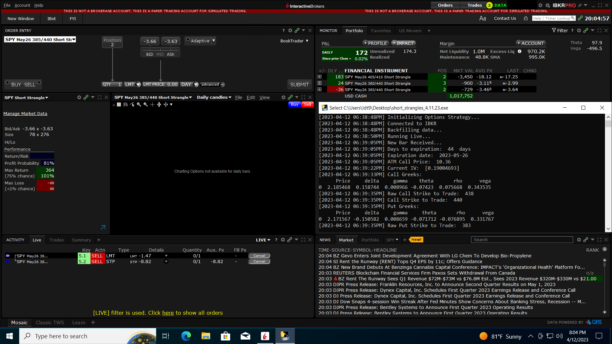
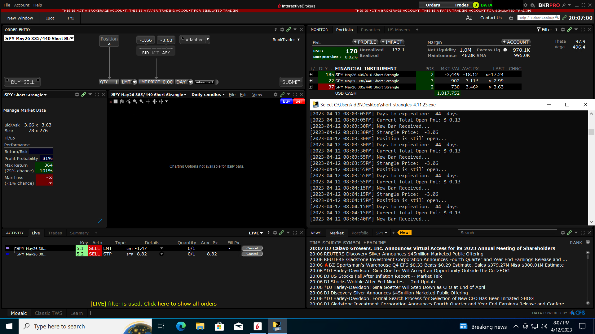

# Delta Neutral Trading Strategy: The Strangle

## Introduction
I have been interested in stock trading and finance since I came to college. This interest has led to my passion to study the idea of value in the markets. I would like to automate an existing strategy that I currently do manually that has generated consistent profit for me almost 80% of the time. Below is an explanation of the strategy and the results of my backtesting.

**NOTE: This project is for informational purposes only. This project and all information contained herein is not investment advice, and not intended to be investment advice. Any trades you make based on this information are your responsibility alone. The project maker disclaims any liability, loss, or risk resulting directly or indirectly, from the use or application of any of the contents of this project.**

### Basic Strategy Rules:
 - Sell a call and a put at 16 delta or 1σ strike in the 45 DTE monthly expiration (or as close as possible)
 - Close at 21 DTE win or lose
 - Set profit target at 50% and stop loss at 200% of net credit received

### Optional Management Tips (that will not be implemented but are good to know):
- Sell when IVR and IVx are > 30%
- Roll untested side when it has decayed 50-80% or when price has breached one of strikes
- Roll untested side into a straddle
- Go inverted and roll one untested strike above the tested strike (make sure the credit you have received thus far is greater than the inversion width)
- Roll out in time and recenter your strangle

### Management Flow Charts:

 

### Advantages:
- Delta Neutral Trading using short options can make a profit without taking any directional risk at time of entry, especially if the underlying stays stagnant for some time after.
- Delta Neutral positions are not affected by small movements made by the underlying but are still affected by time decay as the premium value of the options decay over time.
- By executing a delta neutral position, one can also profit from a decrease in volatility without taking significant directional risk.

### Disadvantages:
- Delta Neutral Trading using short options can turn sour if the underlying continues to trend in one direction for multiple days or weeks.
- Delta Neutral positions are affected by large movements made by the underlying. Theta, or time decay of the premium value of the option, is usually not enough to compensate the large move unless the trade has been on for some time or the deltas are small.
- By executing a delta neutral position with short options, one can lose money from an increase in volatility.

### 3yr Backtesting Results without VIX Optimization:

### 3yr Backtesting Results with VIX Optimization:

### Takeaways from Backtesting:
- The strategy is profitable over the Short/Medium Term
- VIX Optimization has little effect on the performance of the strategy during this time period
    - This is likely due to the fact that the VIX is not a good indicator of future volatility
    - This also rounds out that complex strategies are not needed to make money in the market
- This means our strategy will have the option to trade using VIX optimization such it pose an advantage in the future, but that we will not be using it for the time being.

### Running in an Azure Client:
- The Azure VM I used was a Standard B2s (2 vcpus, 4 GiB memory)
- The VM is running Windows 10 Pro
 

 

 

### Extending this Project:
- Implementing this strategy with futures options instead of equity options
- Make this client more modular so that it can be used for other strategies (simultaneously)
- Implement this strategy such that it capitalizes on the IV _difference_ between the Barone-Adesi And Whaley and Black-Scholes models
  - Calculate the IV of the strangle using the Barone-Adesi And Whaley model and the IV of the strangle using the Black-Scholes model
  - If the IV of the strangle using the Barone-Adesi And Whaley model is **greater** than the IV of the strangle using the Black-Scholes model, then **buy** the strangle
  - If the IV of the strangle using the Barone-Adesi And Whaley model is **less** than the IV of the strangle using the Black-Scholes model, then **sell** the strangle
  - Research more [here](https://medium.datadriveninvestor.com/i-needed-money-so-i-invented-baw-iv-trading-921bea493994)
- Implement this strategy using rolling percent change confidence intervals
- Implement this strategy using a neural network or a deep learning model
- Make a custom interface for it so that the CPU usage isn't tied up in running TWS or Gateway